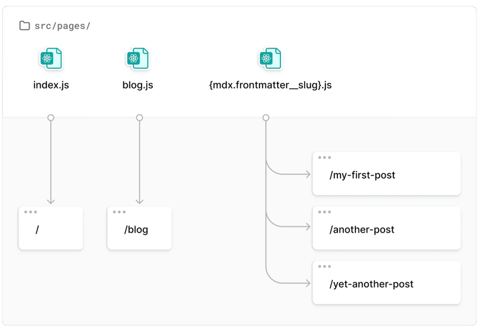

# scorchedrice.com

## 개발일지

### 기본 기능
- Next.js의 app라우터처럼, pages내부의 파일은 각각의 페이지 역할을 수행함.
  - 파일명이 곧 주소임.
- HEADFC : <head>에 들어갈 내용을 작성할 수 있음. 페이지별로 수행 가능
```tsx
export const Head: HeadFC = () =>
  <>
    <title>About Page!</title>
    <meta name="description" content="about page"/>
  </>
```
- Link의 경우엔 해당 컴포넌트가 화면에 보이면, 이를 미리 불러오는 형식으로 최적화를 진행함.

### plugin
- 플러그인을 설치하면, gatsby-config.ts에서 관리해야하며, 다시 재동작 시켜야한다.
- for StaticImage
  - gatsby-plugin-shap
    - 실제 이미지를 gatsby-plugin-image로 다루도록 프로세싱
  - gatsby-source-filesystem
    - 컴퓨터에 있는 데이터를 가져오는 역할. 추후 세부기능 학습

- gatsby-plugin-mdx
  - gatsby-source-filesystem에서 filenode들을 가져오고, 이를 mdx node로 변경하는 기능을 수행함.
  - gatsby-plugin-mdx, @mdx-js/react(react에 적용) 설치

### Graphql
- develop으로 실행하면 로컬주소랑 같이 나오는 ___graphql주소는 실제 graphql 쿼리를 확인할 수 있는 페이지이다.
- Component에서 사용하기 위해선 `useStaticQuery`를 사용한다.
```ts
const data = useStaticQuery(graphql`
  query {
    site {
      siteMetadata {
        title
      }
    }
  }
`)
console.log(data);
```

### SEO
#### useStaticQuery를 사용한 SEO 컴포넌트 생성
- siteMeta의 title값을 가져와서 컴포넌트화 가능함.
- 이처럼 컴포넌트를 만들고 적용한다면, useStaticQuery를 사용하는데, 이 사용한 것에 페이지를 랜더링하는 컴포넌트가 접근 가능해짐
```tsx
 import * as React from 'react';
import Layout from "../widgets/layout/layout";
import {graphql, HeadFC} from "gatsby";
import SEOTitle from "../widgets/seo/MetaTitle";

const BlogPage = ({ data } : { data : any }) => {
  return (
          <Layout>
            <ul>
              {data.allFile.nodes.map(node => (
                      <li key={node.name}>
                        {node.name}
                      </li>
              ))
              }
            </ul>
          </Layout>
  )
}

export const query = graphql`
  query {
    allFile {
      nodes {
        name
      }
    }
  }
`

// query가 SEOTitle에서 사용한 data에 접근 가능함.
export const Head : HeadFC = () =>
        <>
          <SEOTitle title="blog page"/>
        </>

export default BlogPage;
```

### 블로그 게시글 목록 보기
- gatsby-plugin-mdx, @mdx-js/react를 사용함.
- graphql 요청으론 allFile이 아닌 allMdx를 사용함.
```
query MyQuery {
  allMdx(sort: {frontmatter: {date:DESC}}) {
    nodes {
      frontmatter {
        date(formatString:"YYYY-MM-DD")
        title
      }
      id
      excerpt
    }
  }
}
```
- 새로운 Mdx노드를 만들 때, parent 필드가 만들어지는데, 이는 original File Node에서 새로 만들어진 Mdx Node에 접근 가능하도록 하는 기능을한다.
  - 이를 사용하면, 언제 original source에서 node로 변경되었는지 알 수 있다. 즉, 언제 파일이 바뀌었는지 정보를 제공한다.
    - 마지막 수정날짜 등에 활용 가능하다.
```
query MyQuery {
  allMdx {
    nodes {
      parent {
        ... on File {
          modifiedTime(formatString: "MMMM D, YYYY")
        }
      }
    }
  }
}
```

### 블로그 게시글 상세보기
- mdx파일의 slug가 이 역할을 담당한다. 해당 하위 주소로 이동해서 값을 받아오면 된다.

- next에서 approute를 사용하는것과 방식이 동일한데, blog의 하위주소로 하고싶다면, blog라는 폴더를 만들고, index.tsx로 변경한 이후, {mdx.frontmatter__slug}.tsx를 배치하면 된다.

### StaticImage vs GatsbyImage
- Static이미지는 이미지가 변하지 않는 경우, 고정된 주소로 표현할 수 있는 경우 사용.
- Gatsby이미지는 동적으로 이미지를 불러올 때 사용.
- hero Image 사용은 다음처럼한다.
  - 폴더 안에 index.mdx, 그리고 이미지를 보유하도록한다. 즉, 게시글마다 폴더를 가지고 있는 셈이다.
```
query ($id: String) {
mdx(id: { eq: $id }) {
  frontmatter {
    title
    date(formatString: "MMMM D, YYYY")
    hero_image_alt
    hero_image_credit_link
    hero_image_credit_text
    hero_image {
      childImageSharp {
        gatsbyImageData
      }
    }
  }
}
}
```
이런식으로 이미지 관련된 내용을 가져올 수 있다.

```tsx
import * as React from 'react';
import Layout from "../../widgets/layout/layout";
import SEOTitle from "../../widgets/seo/MetaTitle";
import {graphql} from "gatsby";
import {GatsbyImage, getImage} from "gatsby-plugin-image";


const BlogPost = ({ data, children } : { data : any, children : any }) => {
  const image = getImage(data.mdx.frontmatter.hero_image);
  return (
    <Layout>
      <p>Posted: {data.mdx.frontmatter.date}</p>
      <GatsbyImage
        image={image}
        alt={data.mdx.frontmatter.hero_image_alt}
      />
      <p>
        Photo Credit:{" "}
        <a href={data.mdx.frontmatter.hero_image_credit_link}>
          {data.mdx.frontmatter.hero_image_credit_text}
        </a>
      </p>
      {children}
    </Layout>
  )
}

export const query = graphql`
  query($id: String) {
    mdx(id: {eq: $id}) {
      frontmatter {
        title
        date(formatString: "MMMM DD, YYYY")
        hero_image_alt
        hero_image_credit_link
        hero_image_credit_text
        hero_image {
          childImageSharp {
            gatsbyImageData
          }
        }
      }
    }
  }
`

export const Head = ({data}) => <SEOTitle title={data.mdx.frontmatter.title}/>

export default BlogPost;
```

