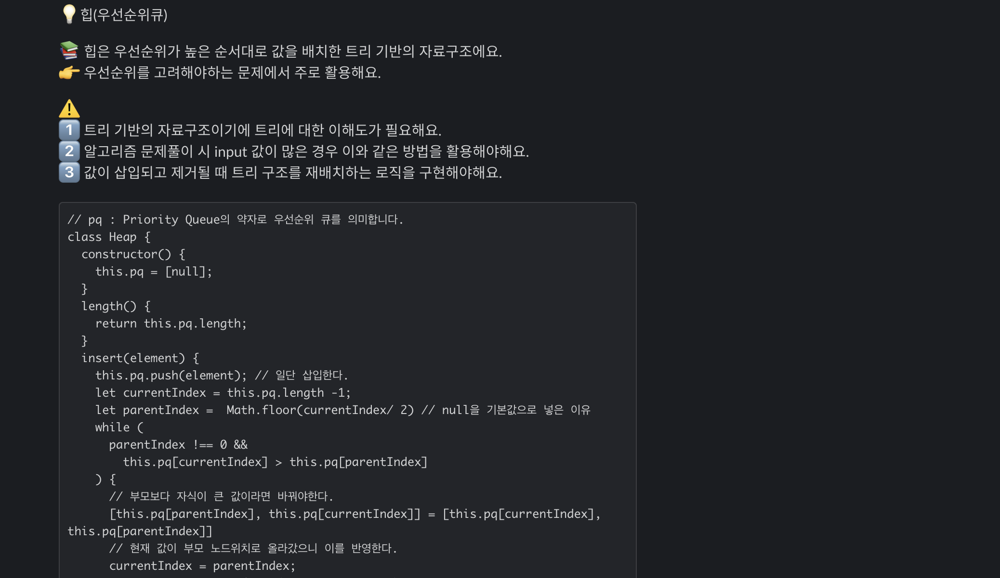
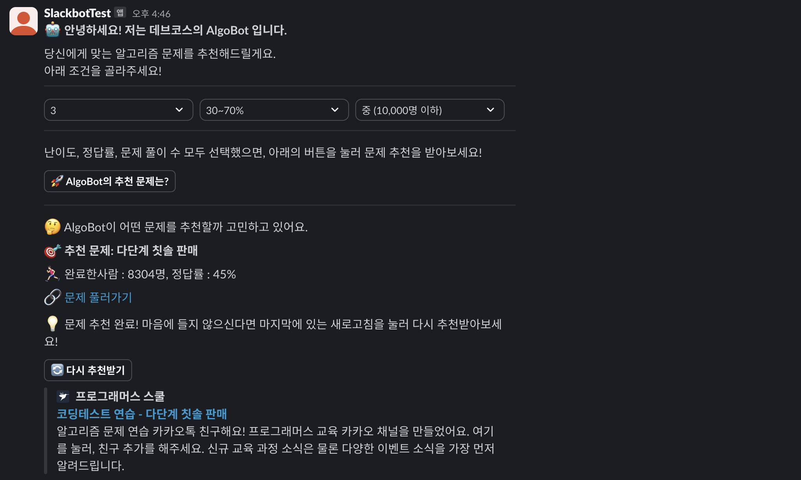
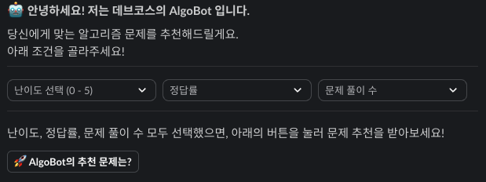

import command from "./algobot-command.png";
import architecture from "./algobot-architecture.png";

프로그래머스 데브코스 분들을 위한 슬랙봇을 개발한 과정을 소개하려고해요. 왜 이 프로젝트를 시작했는지부터, 어떤 방식으로 구현했는지 까지 소개할게요.

<hr/>

## 목차
<ul>
  <li>프로젝트를 진행하게 된 이유</li>
  <li>슬랙봇 구현 과정</li>
</ul>

<hr/>

### 1. 프로젝트를 진행하게 된 이유

프로젝트를 진행한 가장 큰 이유는 함께 교육을 수강하는 데브코스 수강생분들에게 도움을 주고싶어서에요.
저는 이 프로젝트에서 다음 두가지의 기능을 개발했는데, 이를 하나하나 설명드릴게요.

- 기초적인 알고리즘 샘플 코드 제공 (/sample-code [자료구조 이름])
- 알고리즘 문제 추천 (/algobot [기능명])

#### 첫번째, 기초적인 알고리즘 샘플 코드 제공

자바스크립트는 파이선과 같은 언어에 비해 코딩테스트에서 활용 가능한 기능이 적어요. 그렇기에 어려운 문제가 출제된다면 자바스크립트로 문제풀이를 진행하는 개발자는 상대적으로 긴 코드를 작성해야해요.

극단적 예시로 프로그래머스의 <a href="https://school.programmers.co.kr/learn/courses/30/lessons/42627">디스크 컨트롤러</a> 문제 풀이 코드를 비교해볼게요.

<ul>
  <li>
    <a href="https://github.com/jung-jinyoung/algostudy2025/blob/master/4%EC%A3%BC%EC%B0%A8(250408)/%EC%A0%95%EC%A7%84%EC%98%81/%EB%94%94%EC%8A%A4%ED%81%AC%20%EC%BB%A8%ED%8A%B8%EB%A1%A4%EB%9F%AC.py">파이선을 활용한 문제풀이 코드</a>
  </li>
  <li>
    <a href="https://github.com/jung-jinyoung/algostudy2025/blob/master/4%EC%A3%BC%EC%B0%A8(250408)/%ED%95%9C%EC%A7%80%EC%9B%85/%EB%94%94%EC%8A%A4%ED%81%AC%EC%BB%A8%ED%8A%B8%EB%A1%A4%EB%9F%AC.js">자바스크립트를 활용한 문제풀이 코드</a>
  </li>
</ul>

위 두개의 코드를 비교하면 파이선은 50줄, 자바스크립트는 180줄 정도로 문제를 풀었음을 확인할 수 있어요.
파이선은 **heap**을 import하여 빠르게 우선순위 큐를 구현할 수 있지만, 자바스크립트는 하나하나 만들어야하기 때문이에요. 심지어 해당 문제에서는 우선순위를 고려해야하는 것이 여러 요소가 있었기에 더욱 코드가 길어졌어요.

그렇기 때문에 개발을 자바스크립트로 처음 시작하신 분들이 코딩테스트에 느끼는 벽이 정말 높을 것이라고 생각했어요.
개인적으로 코딩테스트 언어를 파이선에서 자바스크립트로 전환하는 과정에서 파이선에선 쉽게 구현했던 기능들이 자바스크립트에선 불가능하여 하나하나 구현해야하는 어려움을 겪은 경험이 있었기에 이 어려움을 해결하는 프로그램을 개발해보고 싶었어요.

그래서, "어? 이 문제 OO자료구조를 요구하는 문제같은데? 근데, 이걸 어떻게 구현해야할까?" 이런 고민이 들 때 활용할 수 있는 힌트를 제공하는 것을 목적으로 개발을 진행했어요.

<details>
  <summary>/sample-code heap을 실행한 결과</summary>

  
</details>

이 기능은 위의 실행 결과를 보면 알 수 있듯, 알고리즘에 대한 간략한 설명과 예시코드를 제공해요. 많은 도움이 되었으면 좋겠네요. :)

<br/>

#### 두번째, 알고리즘 문제 추천

코딩테스트 대비를 목적으로 알고리즘 스터디를 진행하고 계신 수강생분들에게 도움을 드리고 싶었어요. 문제 난이도와 문제를 푼 사람 수, 정답률을 선택하면 이에 맞게 문제를 추천할 수 있는 기능을 구현했어요.

<details>
  <summary>알고리즘 문제 추천 결과</summary>

  
</details>

이 기능을 활용해서 스터디장분들이 문제를 선정하는 과정을 빠르게 할 수 있도록 도움드리고 싶었어요.

<hr/>

### 2. 슬랙봇 구현과정


슬랙봇의 구성은 크게 **slack에서 입력한 슬래시 명령어를 처리하는 command**, **버튼 클릭과 같은 이벤트를 처리하는 handler**, **비즈니스 로직을 처리하는 service** 로 구성되어 있어요.

#### 첫번째, 슬래시 명령어를 처리하는 과정


슬랙봇이 동작하는 과정 첫번째는 위의 이미지와 같아요. **main.js**는 슬랙봇의 명령어 진입 지점이라고 볼 수 있고, 진입한 이후엔 슬래시 명령어에 맞는 **command.js** 로직을 실행시켜요.

command.js에선 해당 커맨드의 명령어를 분석하고 이에 맞는 처리를 수행해요.

<details>
  <summary>예시코드 (command.js)</summary>

  ```js
  const service = require('./service');
  const {chooseAlgorithm} = require("./service");

  function algoBot(app) {
    // sample-code 슬래시 명령어를 입력한 경우 실행될 함수
    app.command('/sample-code', async ({ command, ack, say }) => {
      await ack();
      const dataStructure = command.text.trim().toLowerCase(); // 뒤에 추가로 입력한 명령어
      const example = chooseAlgorithm(dataStructure); // 이에 해당하는 알고리즘을 가져옴
      await say({
        // ... slack에 나타날 텍스트, UI를 정의
      })
    })
    app.command('/algobot', async ({command, ack, say}) => {
      await ack();
      const order = command.text.trim().toLowerCase(); // 뒤에 추가로 입력한 명령어
      if (order === 'recommend') {
        await say({
          // recommend란 명령어가 발생하면 보여줄 텍스트와 UI
        })
      } else {
        // recommend 명령이 아닌 경우 진행될 로직이에요.
      }
    })
  }

  module.exports = { algoBot };
  ```
</details>

#### 두번째, 사용자가 조작하는 버튼 등의 이벤트 관리



개발한 알고리즘 문제 추천 기능엔 버튼 조작 이벤트가 많이 있어요. 이와 같은 이벤트들은 **handler.js**에서 관리해요.

이벤트가 발생해야하는 것들은 **action**타입의 버튼들로 구성되어있고, 이벤트가 발생할 때 마다 **handler.js**에 있는 처리함수에 요청을 보내요.

<br/>

위 이미지 중 난이도 선택을 예시로 과정을 설명해볼게요.

<details>
  <summary>난이도 선택 버튼 구현 예시 코드</summary>

    ```js
    {
      type: 'actions',
      elements: [
    {
      type: 'static_select',
      action_id: 'select_difficulty',
      placeholder: {
      type: "plain_text",
      text: "난이도 선택 (0 - 5)"
    },
      options: [0, 1, 2, 3, 4, 5].map((level) => ({
      text: {
      type: 'plain_text',
      text: `${level}`
    },
      value: `difficulty_${level}`
    }))
    },
      // UI ..
      ]
    }
    ```
</details>

<details>
  <summary>handler.js 해당 이벤트 처리 함수</summary>

  ```js
  function selectDifficulty(app) {
    app.action('select_difficulty', async ({ body, ack, say }) => {
      await ack();
      const userId = body.user.id;
      const selected = body.actions[0].selected_option.value;
      userSelection[userId] = { ...(userSelection[userId] || {}), difficulty: selected };
    })
  }
  ```
</details>

사용자가 보는 버튼과 이를 처리하는 handler 함수는 위와 같이 구현되어있어요.

다른 버튼들 모두 이벤트가 발생하면 value값을 해당 action_id를 가지고 있는 handler.js의 특정 함수에 전달해요.
전달받은 함수는 이 value값을 바탕으로 연산을 진행해요.

알고리즘 문제 추천 기능의 경우 사용자가 난이도, 정답률, 풀이 수를 선택할 때 마다 이를 저장하고 있다가 3가지를 모두 선택한 경우에만 결과를 반환할 수 있는 기능을 구현했어요.

#### 세번째, 핵심 동작을 수행하는 service

**service.js**는 슬랙봇의 핵심 기능을 담당해요. 문제추천 기능의 경우 조건에 맞게 필터링하는 동작이 여기에 해당해요.

**handler.js**에서 "algoBot의 추천 문제는?" 버튼은 사용자가 세가지의 옵션을 모두 선택했는지 확인하고, 만약 세가지를 모두 선택했다면 **service.js**의 필터링 함수를 호출해요.
이후 선택지에 맞는 필터링 연산을 수행하고 결과를 사용자에게 보여주는 방식으로 기능이 동작해요.

<hr/>

## 결론

평소 개발자가 갖춰야 하는 핵심역량이 문제를 인식하고 이를 해결하기 위해 기술에 구애받지 않고 추진할 수 있는 역량이라고 생각했는데, 이와 부합한 프로젝트였기에 더욱 가치있는 프로젝트라고 생각해요.
